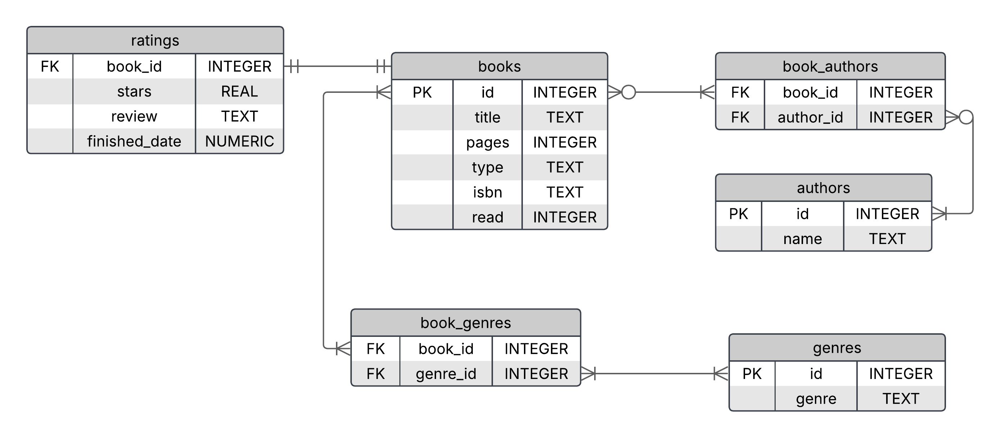

# Design Document

By Yago Calixto Carvalho da Silva

Video overview: [<https://youtu.be/VA7rxdH9WLA>]

## Scope

This database includes all datas to catalog my books and future books in my whishlist.
Included in database's scope are:

* Books, including its basic informations
* Author's name, just to identify its writer
* Genres, to catalog the books
* Ratings, to rank and give my personal review

There isn't any data outside the scope

## Functional Requirements

This database will support:

* CRUD operations for books
* Catalog their collections of books, marking some as read
* Review a book after its reading, inserting stars for rank, reviews and when the reading was finished
* Add authors and genres to the database, relating them to the books
* Modify books' informations, authors' name and genres

This database doesn't support adding images like covers and outside informations

## Representation

### Entities

The database includes the following entities:

#### Books
The `books` table includes:

* `id`, which is the table's indentification as an `INTEGER` and is the `PRIMARY KEY` of this table
* `title`, which represents the book's title using `TEXT` type, it must be `NOT NULL`because is the main data from this table and also `UNIQUE` since a book doens't have many titles
* `isbn`, which is the universal code of a book, it uses `TEXT` since it's the identification of a book and won't have any other purpose, `NOT NULL` to be necessary its appereance, `UNIQUE` since it's like the individual identification for each book and must have a lenght of 13 chacacters
* `pages`, which shows how many pages has in the book using `INTEGER` type and is an important information for readers to measure the book, so it needs to be `NOT NULL`
* `type`, using `TEXT` type this column represents what type of book I read it, using `CHECK` to check if it's paperbook, ebook, hq or manga
* `read`, this column represents whether I read or not the book using `INTEGER` type 0 and 1 to represent boolean values.

#### Auhtors
The `authors` table includes:

* `id`, which is the table's indentification as an `INTEGER` and is the `PRIMARY KEY` of this table
* `name`, which is the name of an author with `TEXT` type.
This table doesn't nedde too much information of an author since we only use it to show who wrote each book and nothing more

#### Genres
The `genres` table includes:

* `id`, which is the table's indentification as an `INTEGER` and is the `PRIMARY KEY` of this table
* `genre`, which includes the book genres to specify each book, it uses `TEXT` to write its genres. It must be `NOT NULL` because each row needs a genre to fill it and `UNIQUE` since doesn't have two action genres for example

#### Ratings
The `ratings` table includes:

* `book_id`, this `FOREING KEY` references the `id` column in `books` table and has the `INTEGER` type
* `stars`, this column represents a value between 0 and 5 stars to rank my opinion for each book, it has the `REAL` type because it uses float numbers, `NOT NULL` because I must classify my opinion and `CHECK` to see if it is between 0 and 5.
* `review`, which describes my opinion using `TEXT`, in this column I can write what I think about a book and if I don't want to write anything I can use the `DEFAULT` value "No data"
* `finished_date`, this column represents the date I finished a book, this register automatically when I put a review in this table. Timestamps in SQLite can be represented as `NUMERIC`. The `DEFAULT` value is the `CURRENT_DATE` which gives a date in YYYY-MM-DD format

#### Book Authors
The `book_authors`table includes:

* `book_id`, this `FOREING KEY` references the `id` column in `books` table and has the `INTEGER` type
* `author_id`, this `FOREIGN KEY` references the `id`column in `authors` table and has the `INTEGER` type
* The primary key is a combination between `book_id` and `author_id` to avoid duplicates in this table

#### Book Genres
The `book_genres` table includes:

* `book_id`, this `FOREING KEY` references the `id` column in `books` table and has the `INTEGER` type
* `genre_id`, this `FOREIGN KEY` references the `id`column in `genres` table and has the `INTEGER` type, this also has a `DEFAULT` value as 0 for when a book doesn't have specifc genre, this id 0 represents "No data" in `genres` table
* The primary key is a combination between `book_id` and `genre_id` to avoid duplicates in this table

### Relationships

The below entity relationship diagram describes the relationships among the entities in the database.

* A `book` can have one or more `genres`, and a `genre` can belong to one or more `books`, so it would be a many-to-many relationship
* A `book` can have one or more `authors`, and an `author` can write one or more `books`, so it would also be a many-to-many relationship
Note that if a book doesn't have an author or genre it will relate with the default value 0 for each relation, so it would have a relation in this case
* A `book` can have one and only one `review` in the `ratings` table, and each `review` belongs to one `book`, so it would be one-to-one relationship

## Optimizations

### Views
* `my_books` shows all information about a book, it includes title, pages, year, isbn, type, authors, genres and if it was read or not
* `books_read` uses `my_books` as references to select only the books that has been read
* `to_be_read` works just like `books_read` but instead of showing the books that has been read it shows the ones that hasn't been read
* `my_reviews` show information about the books I read, showing title, stars, review and when it was finished
* `authors_book` and `genres_book` shows the relation between authors and genres with the books
* `more_pages` shows `my_books` ordered by pages in a descending order
* `fewer_pages` shows `my_books` ordered by pages in an ascending  order
* `recent_reading` shows `my_reviews` ordered by finished_date in an ascending  order
* `old_reading` shows `my_reviews` ordered by finished_date in a descending order

### Indexes
I created 3 indexes to improve its performance. They are `books_search` which improve a search inside the `books` table using the `id` and `title` column. The `book_id_authors` and `book_id_genres` search for the `book_id` but in `book_authors` table and `book_genres` table respectively.

### Trigger
I created the `book_review`trigger to change the `read` column in `books` table to change from 0 to 1 every time a review is inserted in the `ratings` column.
Both `default_author` and `default_genre` are used when a new relation between a book and an anthor or genre is created but the author ou genre doesn't exist in the database, so this trigger will inserto 0 in `author_id` and `genre_id`, to use its default value.

## Limitations

The current `authors` table only store the author's name and nothing more.
Since a book can have only one review at a time, there is no support for multiple reviews of the same book over time.
Due to the use of isbn code it doesn't allow us to insert diferent versions and editions of the same book
